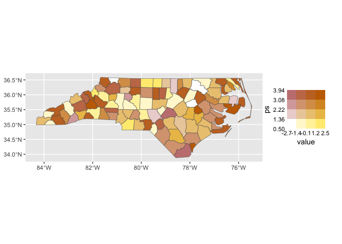
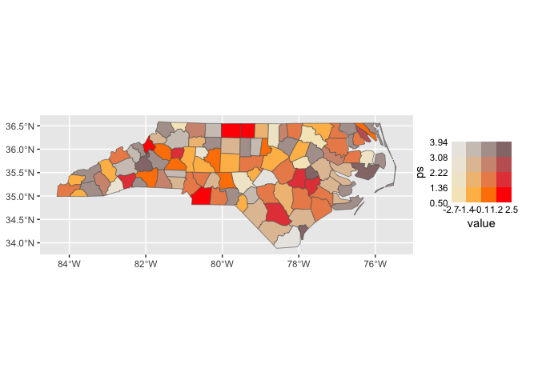
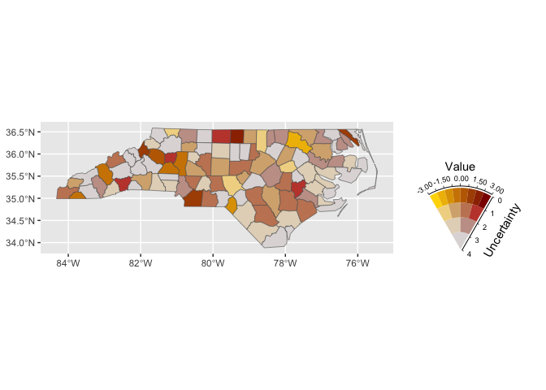
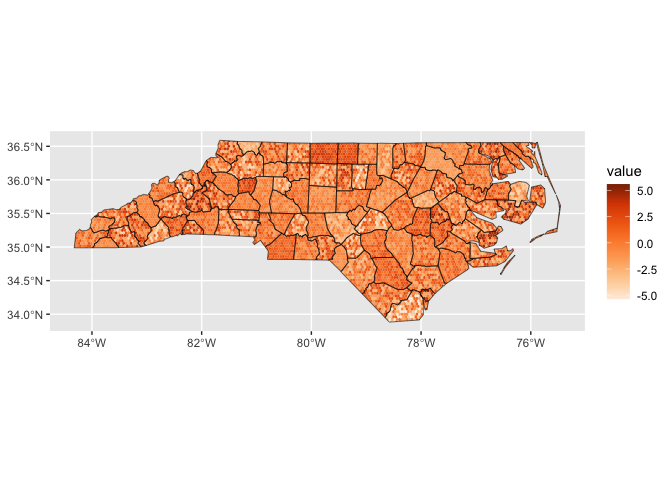
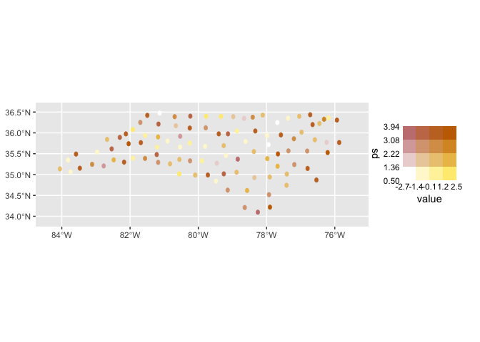
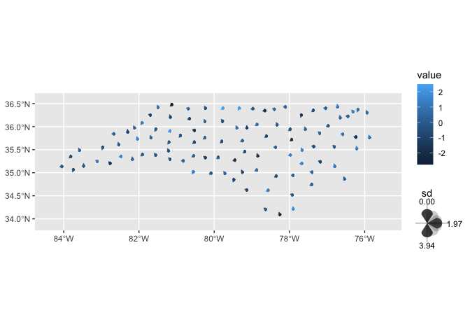
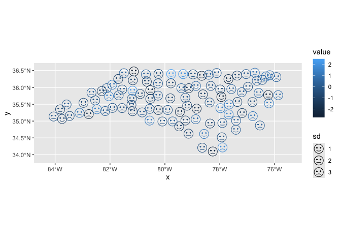
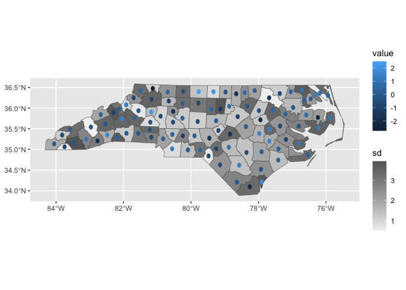

<!-- README.md is generated from README.Rmd. Please edit that file -->

# ggincerta

<!-- badges: start -->

[](https://CRAN.R-project.org/package=ggincerta)
[](https://github.com/maggiexma/ggincerta/actions/workflows/R-CMD-check.yaml)
[](https://app.codecov.io/gh/maggiexma/ggincerta)
<!-- badges: end -->

## Overview

ggincerta is an extension of ggplot2 that introduces new layers and
scales for visualizing spatial uncertainty, and can be extended to more
general bivariate schemes. It reimplements the visualisation methods for
three types of maps introduced in the Vizumap package in a way that
fully aligns with the grammar of graphics and integrates seamlessly with
the ggplot2 ecosystem. It makes the visualisation process more flexible
and convenient, while also adding additional visualisation options.

## Installation

``` r
# Install the release from CRAN:
install.packages("ggincerta")

# Install the development version from GitHub:
# install.packages("pak")
pak::pak("maggiexma/ggincerta")
```

## Usage

The example dataset included in ggincerta is an sf object adapted from
the `nc` shapefile in the sf package. It contains two simulated columns
value and sd, which are mainly used in example maps to demonstrate how
to visualise regional uncertainty alongside average estimates. For more
details about the description and design of three map types, see
<https://doi.org/10.1002/sta4.150>.

``` r
library(ggincerta)
#> Loading required package: ggplot2
```

The ggincerta package defines a new scale function,
`scale_*_bivariate()`, for creating bivariate colour mapping schemes
that work with `geom_sf()`. In the data space, two variables are
discretised into `n_breaks` bins, forming crossed combinations that are
mapped to a colour grid. Each cell in the colour grid is generated
through a chosen mixture of visual properties, such as hue, lightness,
saturation, or opacity.

``` r
ggplot(nc) + geom_sf(aes(fill = duo(value, sd)))
```



The figure above shows the default visual effect of
`scale_*_bivariate()`, where colours are generated by additive mixing in
RGB space between two hue-based lightness gradient ramps. Another option
is to use the provided `bivar_fade_palette()` to specify colours for the
value dimension, while progressively suppressing another perceptual
dimension along the uncertainty axis.

``` r
ggplot(nc) + geom_sf(aes(fill = duo(value, sd))) +
  scale_fill_bivariate(palette_fun = bivar_fade_palette,
                       colours = c("#F6E8C3", "orange", "red"),
                       palette_params = list(fade = "desaturate"))
```



Value-Suppressing Uncertainty Palettes proposed by Correll et al. (2018)
can be implemented by `scale_*_vsup()` in ggincerta. The main idea is to
suppress colour variation in regions with higher uncertainty, thereby
directing visual attention towards more reliable value differences.

``` r
ggplot(nc) +
  geom_sf(aes(fill = duo(value, sd))) +
  scale_fill_vsup(
    breaks = list(
      seq(-3, 3, length.out = 9),
      seq(0, 4, length.out = 5)
    ),
    limits = list(
      c(-3, 3),
      c(0, 4)
    )
  ) + theme(legend.text = element_text(size = 7))
```



ggincerta defines two layer functions `geom_sf_pixel()` and
`geom_sf_glyph()` for creating pixel and glyph maps, respectively. They
can be used in the same way as other `geom_*()` functions in ggplot2,
like `geom_point()`.

``` r
ggplot(nc) + geom_sf_pixel(mapping = aes(fill = duo_pixel(value, sd)), seed = 123)
#> geom_sf_pixel_new(): input data has a geographic CRS and sf is using s2; pixelation may be slow. Consider transforming to a projected planar CRS first.
```



Each unit region in a pixel map is tessellated into pixels. Pixel values
are sampled from a specified probability distribution parameterised by
`v1` and `v2` for each region, and are then mapped to the colour
aesthetic. Greater variation in pixel colours within a region indicates
higher uncertainty.

Glyph maps are essentially centroid maps. ggincerta provides glyphs with
different shapes and corresponding aesthetics for simultaneously
visualising value and uncertainty. One option uses regular shapes,
including circles, squares, triangles, and hexagons, which can work
together with `scale_colour_bivariate()`.

``` r
ggplot(nc) + geom_sf_glyph(mapping = aes(colour = duo(value, sd)))
#> Warning: st_point_on_surface assumes attributes are constant over geometries
#> Warning in st_point_on_surface.sfc(st_geometry(x)): st_point_on_surface may not
#> give correct results for longitude/latitude data
```



Another type of glyph is drop-shaped, where uncertainty is represented
by the rotation angle through the newly introduced `angle` aesthetic.

``` r
ggplot(nc) +
  geom_sf_glyph(aes(colour = value, angle = sd), shape = "drop")
#> Warning: st_point_on_surface assumes attributes are constant over geometries
#> Warning in st_point_on_surface.sfc(st_geometry(x)): st_point_on_surface may not
#> give correct results for longitude/latitude data
```



The remaining glyph form is the Chernoff face, originally proposed by
Herman Chernoff (1973), which uses human facial expressions to represent
multivariate values. The implementation in ggincerta builds upon the
grob and scale design provided by the ggChernoff package. In the example
below, facial colour is mapped to the estimated value, while facial
expression conveys uncertainty in an intuitive and perceptually
meaningful manner: lower uncertainty produces smiling faces, whereas
higher uncertainty results in frowning faces.

``` r
ggplot(nc) +
  geom_sf_glyph(aes(colour = value, smile = sd), shape = "chernoff")
#> Warning in st_point_on_surface.sfc(data$geometry): st_point_on_surface may not
#> give correct results for longitude/latitude data
```



The final visualisation type in ggincerta is the dual map, which
combines a glyph map with a conventional colour-filled choropleth map in
a two-layer display. This design allows two variables to be represented
using separate mappings, scales, and guides, so that their original
values remain directly interpretable. At the same time, it preserves the
ability of the choropleth layer to show the spatial trend of the primary
variable. In addition, it supports the `duo()` mapping and can therefore
be used together with `scale_bivariate()` to achieve three-variable
visualisation within a single map.

``` r
ggplot(nc) + geom_sf_dualmap(aes(fill = sd, colour = value))
#> Warning: st_point_on_surface assumes attributes are constant over geometries
#> Warning in st_point_on_surface.sfc(st_geometry(x)): st_point_on_surface may not
#> give correct results for longitude/latitude data
```


